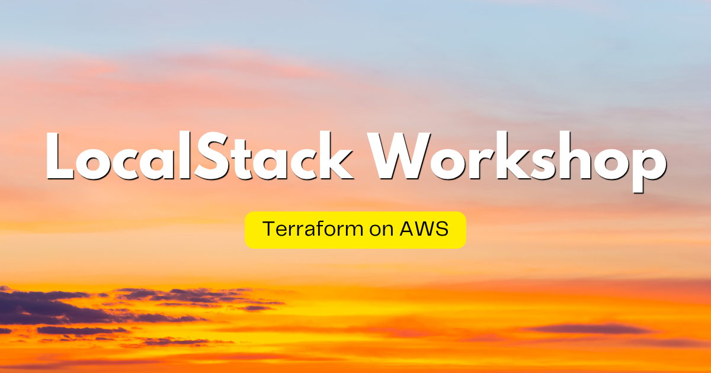

# LocalStack Workshop | Terraform on AWS

## Languages

- English (this page)
- [日本語 — Zenn Book「LocalStack 実践入門 | AWS x Terraform 入門ワークショップ」](https://zenn.dev/kakakakakku/books/aws-terraform-workshop-using-localstack)

## About

LocalStack is an AWS emulator that runs on your local machine or in CI environments. This workshop is a hands-on introduction to Terraform, an Infrastructure as Code (IaC) tool, using LocalStack. You can experience deploying AWS resources with Terraform and the Terraform AWS Provider — *without creating an AWS account*.

The workshop uses GitHub Codespaces, so there is no need to set up an environment on your laptop — you can try it right away in your browser.

This workshop covers the following AWS services (in no particular order):

- Amazon S3
- AWS Lambda
- Amazon CloudWatch Logs
- AWS IAM

## Table of Contents

1. [Set Up Your Workshop Environment](docs/01-setup.md)
2. [Deploy an Amazon S3 Bucket](docs/02-s3.md)
3. [Modify the Amazon S3 Bucket](docs/03-s3-update.md)
4. [Deploy an AWS Lambda Function](docs/04-lambda.md)
5. [Deploy a Serverless Application](docs/05-s3-lambda.md)
6. [Understand Resource Replacement](docs/06-replace.md)
7. [Import Existing Resources](docs/07-import.md)
8. [Run Static Analysis](docs/08-linter.md)
9. [Learn the Basics of State Files](docs/09-tfstate.md)

## LocalStack Workshop Series

Check out the other workshops in the series!

|  |  |  |
|:---:|:---:|:---:|
| [Application Development on AWS](https://github.com/kakakakakku/aws-application-workshop-using-localstack) | [Serverless Patterns on AWS](https://github.com/kakakakakku/aws-serverless-pattern-workshop-using-localstack) | [Pulumi on AWS](https://github.com/kakakakakku/aws-pulumi-workshop-using-localstack) |

## Sponsors

If you find this workshop useful, consider supporting my work — it keeps the workshops maintained and motivates new ones 😃

- [GitHub Sponsors](https://github.com/sponsors/kakakakakku)
- [Buy Me a Coffee](https://buymeacoffee.com/kakakakakku)
