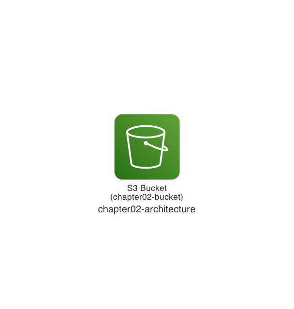

# Chapter 2: Deploy an Amazon S3 Bucket

In Chapter 2, let's start by experiencing how to deploy an AWS resource with Terraform. I will walk you through the flow of running Terraform and the commands you need.

## Architecture

The configuration we will deploy looks like the architecture below. It is simple — just a single Amazon S3 bucket.



## LocalStack Terraform CLI

You normally run Terraform with the Terraform CLI (the `terraform` command). In this workshop, however, we use the [LocalStack Terraform CLI](https://github.com/localstack/terraform-local) (the `tflocal` command) instead of the Terraform CLI. The LocalStack Terraform CLI is a wrapper around the Terraform CLI: it temporarily generates a file (`localstack_providers_override.tf`) that makes Terraform run against LocalStack, and removes it after the run. You just replace `terraform` with `tflocal`, and everything works essentially the same way.

The example below checks the version with both the `terraform` command and the `tflocal` command.

```sh
$ terraform --version
Terraform v1.10.5
on linux_amd64

$ tflocal --version
terraform-local v0.26.0
Terraform v1.10.5
on linux_amd64
```

## Deploy with Terraform (`terraform init`)

When you run a Terraform project for the first time, you first need to initialize the project with the `terraform init` command (the `tflocal init` command).

Initialization downloads the Terraform plugins called providers that Terraform needs (in this case, the [Terraform AWS Provider](https://github.com/hashicorp/terraform-provider-aws)) and creates a lock file that records the versions of the downloaded providers.

```sh
$ cd ${CODESPACE_VSCODE_FOLDER}/chapter02
$ tflocal init
(omitted)
Terraform has been successfully initialized!
```

If you see `Terraform has been successfully initialized!`, it worked!

For details, see the [`terraform init` command documentation](https://developer.hashicorp.com/terraform/cli/commands/init).

## Deploy with Terraform (`terraform plan`)

For Chapter 2, I have prepared `main.tf`, the Terraform code that deploys an Amazon S3 bucket. It is only three lines! But first, let's focus on experiencing the flow of running Terraform. The code walkthrough is at the end of Chapter 2.

```hcl
resource "aws_s3_bucket" "chapter02" {
  bucket = "chapter02-bucket"
}
```

Now, before deploying the Amazon S3 bucket, there is one more important step. The `terraform plan` command (the `tflocal plan` command) lets you preview the changes (a dry run) before actually running Terraform. You want to avoid deploying without checking and then running into an unexpected change 😇.

Let's run the command.

```sh
$ tflocal plan
```

The output is a little long, but rather than trying to understand all of it, let's focus on the following points!

First is the entire block that starts with `+ resource "aws_s3_bucket" "chapter02" {` and ends with `}`. This means a new Amazon S3 bucket (`aws_s3_bucket`) is being added (`+`), with `chapter02` as its resource name (the identifier inside the Terraform code).

The other point is the last line, `Plan: 1 to add, 0 to change, 0 to destroy.`. This means that the preview shows one resource to be added (`1 to add`). In other words, there are no resource changes (`0 to change`) and no resource deletions (`0 to destroy`).

This matches the architecture I showed at the beginning of Chapter 2!

```sh
Terraform used the selected providers to generate the following execution plan. Resource actions are indicated with the following symbols:
  + create

Terraform will perform the following actions:

  # aws_s3_bucket.chapter02 will be created
  + resource "aws_s3_bucket" "chapter02" {
      + acceleration_status         = (known after apply)
      + acl                         = (known after apply)
      + arn                         = (known after apply)
      + bucket                      = "chapter02-bucket"
      + bucket_domain_name          = (known after apply)
      + bucket_prefix               = (known after apply)
      + bucket_regional_domain_name = (known after apply)
      + force_destroy               = false
      + hosted_zone_id              = (known after apply)
      + id                          = (known after apply)
      + object_lock_enabled         = (known after apply)
      + policy                      = (known after apply)
      + region                      = (known after apply)
      + request_payer               = (known after apply)
      + tags_all                    = (known after apply)
      + website_domain              = (known after apply)
      + website_endpoint            = (known after apply)

      + cors_rule (known after apply)

      + grant (known after apply)

      + lifecycle_rule (known after apply)

      + logging (known after apply)

      + object_lock_configuration (known after apply)

      + replication_configuration (known after apply)

      + server_side_encryption_configuration (known after apply)

      + versioning (known after apply)

      + website (known after apply)
    }

Plan: 1 to add, 0 to change, 0 to destroy.
```

For details, see the [`terraform plan` command documentation](https://developer.hashicorp.com/terraform/cli/commands/plan).

## Deploy with Terraform (`terraform apply`)

Thanks for waiting! The last step is the deployment. In Terraform, you deploy with the `terraform apply` command (the `tflocal apply` command). Let's run the command.

> [!NOTE]
> You will be prompted with `Enter a value:`, so type `yes`.

```sh
$ tflocal apply

(omitted)

Do you want to perform these actions?
  Terraform will perform the actions described above.
  Only 'yes' will be accepted to approve.

  Enter a value: yes

(omitted)

aws_s3_bucket.chapter02: Creating...
aws_s3_bucket.chapter02: Creation complete after 0s [id=chapter02-bucket]

Apply complete! Resources: 1 added, 0 changed, 0 destroyed.
```

If you see `Apply complete! Resources: 1 added, 0 changed, 0 destroyed.`, it worked!

For details, see the [`terraform apply` command documentation](https://developer.hashicorp.com/terraform/cli/commands/apply).

## Verify the Resources

Let's use the LocalStack AWS CLI (the `awslocal` command) to check the chapter02-bucket bucket! The Amazon S3 bucket should be deployed.

```sh
$ awslocal s3 ls
2026-07-27 00:00:00 chapter02-bucket
```

That's it for Chapter 2! ✋

## Code Walkthrough

Here is a quick walkthrough of the key points in the code. Feel free to skip this section.

### `provider.tf`

First, `provider.tf` holds the settings for Terraform itself and for the Terraform plugins called providers. There is no rule about the file name — for small Terraform code, you can even put everything directly in `main.tf`.

Here, the `terraform` block specifies the Terraform version that can run and the version of the **Terraform AWS Provider** that lets Terraform operate AWS. In addition, the `provider` block specifies the `us-east-1` (N. Virginia) Region as the default region to deploy to with the Terraform AWS Provider.

```hcl
terraform {
  required_providers {
    aws = {
      source  = "hashicorp/aws"
      version = "~> 6.56.0"
    }
  }
  required_version = "~> 1.10.0"
}

provider "aws" {
  region = "us-east-1"
}
```

### `main.tf`

Next is `main.tf`. Terraform code uses the `.tf` extension, and for small Terraform code you implement it in `main.tf` (of course, splitting it across multiple files is also common).

The implementation is simple. You do not need to worry about the fine details of the syntax at this point — just keep the following points in mind. The [aws_s3_bucket](https://registry.terraform.io/providers/hashicorp/aws/latest/docs/resources/s3_bucket) resource is covered in the documentation. Reading the documentation is very important, but since we refer to it in other chapters, I will only mention it here.

- `aws_s3_bucket`: the resource type to deploy
- `chapter02`: the resource name to deploy (the identifier inside the Terraform code)
- `bucket = "chapter02-bucket"`: the resource argument to deploy (the Amazon S3 bucket name)

```hcl
resource "aws_s3_bucket" "chapter02" {
  bucket = "chapter02-bucket"
}
```

That's it for the code walkthrough.

**Next: [Chapter 3: Modify the Amazon S3 Bucket](03-s3-update.md)**
