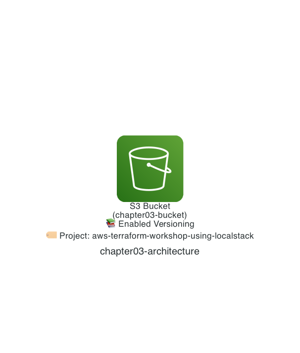

# Chapter 3: Modify the Amazon S3 Bucket

In Chapter 2, we used Terraform to deploy an Amazon S3 bucket. Terraform is used not only to deploy (newly add) AWS resources, but also to deploy (modify) them. In Chapter 3, let's experience modifying an AWS resource with Terraform.

## Architecture

The configuration we will deploy looks like the architecture below. We keep the simple, single Amazon S3 bucket configuration, and add a tag and enable versioning.

One important point: not only with Terraform but with any IaC tool, you must always change a deployed resource through Terraform 💪. If you change the settings manually, you cause drift — a mismatch between "the Terraform code (the expected state)" and "the resource's actual settings (the real-world state)."



## Deploy with Terraform

As a review of Chapter 2, let's deploy an Amazon S3 bucket.

The flow of running the `terraform init` command (the `tflocal init` command), the `terraform plan` command (the `tflocal plan` command), and the `terraform apply` command (the `tflocal apply` command) is the same 😀.

> [!NOTE]
> You will be prompted with `Enter a value:`, so type `yes`.

```sh
$ cd ${CODESPACE_VSCODE_FOLDER}/chapter03
$ tflocal init
$ tflocal plan
$ tflocal apply

(omitted)

Do you want to perform these actions?
  Terraform will perform the actions described above.
  Only 'yes' will be accepted to approve.

  Enter a value: yes

aws_s3_bucket.chapter03: Creating...
aws_s3_bucket.chapter03: Creation complete after 0s [id=chapter03-bucket]

Apply complete! Resources: 1 added, 0 changed, 0 destroyed.
```

If you see `Apply complete! Resources: 1 added, 0 changed, 0 destroyed.`, it worked!

## 1. Add a Tag

Now, let's add a tag to the deployed Amazon S3 bucket. In AWS, you can set arbitrary Key/Value tags on resources and use them to classify resources, review cost allocation, and more. This time, I want to add a `Project` tag as the name of the project that manages the Amazon S3 bucket.

```
Project: aws-terraform-workshop-using-localstack
```

When you implement Terraform code, reading the documentation is important. Let's check the [aws_s3_bucket](https://registry.terraform.io/providers/hashicorp/aws/latest/docs/resources/s3_bucket) resource documentation. You will find that you can set tags with the `tags` argument, as shown below.

Update `chapter03/main.tf` in GitHub Codespaces.

```diff hcl
 resource "aws_s3_bucket" "chapter03" {
   bucket = "chapter03-bucket"
+
+  tags = {
+    Project = "aws-terraform-workshop-using-localstack"
+  }
 }
```

> [!NOTE]
> With the Terraform AWS Provider, you can use [default_tags](https://registry.terraform.io/providers/hashicorp/aws/latest/docs/data-sources/default_tags) to apply tags to multiple AWS resources at once. In this workshop, we set an individual tag as an example of modifying an AWS resource.

### Deploy with Terraform (`terraform plan`)

Before deploying, use the `terraform plan` command (the `tflocal plan` command) to preview the changes. Let's run the command.

At the top, you see `~ update in-place`. This means the resource will be modified. Then, looking at the entire block that starts with `~ resource "aws_s3_bucket" "chapter03" {` and ends with `}`, you see `~ tags` and `+ "Project" = "aws-terraform-workshop-using-localstack"`. The `Project` tag will be added as expected 😀.

```sh
$ tflocal plan
Terraform used the selected providers to generate the following execution plan. Resource actions are indicated with the following symbols:
  ~ update in-place

Terraform will perform the following actions:

  # aws_s3_bucket.chapter03 will be updated in-place
  ~ resource "aws_s3_bucket" "chapter03" {
        id                          = "chapter03-bucket"
      ~ tags                        = {
          + "Project" = "aws-terraform-workshop-using-localstack"
        }
      ~ tags_all                    = {
          + "Project" = "aws-terraform-workshop-using-localstack"
        }
        # (12 unchanged attributes hidden)

        # (3 unchanged blocks hidden)
    }

Plan: 0 to add, 1 to change, 0 to destroy.
```

### Deploy with Terraform (`terraform apply`)

Finally, deploy with the `terraform apply` command (the `tflocal apply` command). Let's run the command.

> [!NOTE]
> You will be prompted with `Enter a value:`, so type `yes`.

```sh
$ tflocal apply

aws_s3_bucket.chapter03: Refreshing state... [id=chapter03-bucket]

(omitted)

Do you want to perform these actions?
  Terraform will perform the actions described above.
  Only 'yes' will be accepted to approve.

  Enter a value: yes

aws_s3_bucket.chapter03: Modifying... [id=chapter03-bucket]
aws_s3_bucket.chapter03: Modifications complete after 0s [id=chapter03-bucket]

Apply complete! Resources: 0 added, 1 changed, 0 destroyed.
```

If you see `Apply complete! Resources: 0 added, 1 changed, 0 destroyed.`, it worked!

### Verify the Resources

Let's use the LocalStack AWS CLI (the `awslocal` command) to check the tags on the Amazon S3 bucket!

```sh
$ awslocal s3api get-bucket-tagging --bucket chapter03-bucket
{
    "TagSet": [
        {
            "Key": "Project",
            "Value": "aws-terraform-workshop-using-localstack"
        }
    ]
}
```

## 2. Enable Versioning

Now, in Chapter 3, let's make one more change.

Amazon S3 has a versioning feature that keeps previous versions of an object when you upload an object with the same name or delete an object. It is disabled by default.

Let's check the [aws_s3_bucket](https://registry.terraform.io/providers/hashicorp/aws/latest/docs/resources/s3_bucket) resource documentation again. You will find that you can configure versioning with the `versioning` argument, as shown below.

```diff hcl
 resource "aws_s3_bucket" "chapter03" {
   bucket = "chapter03-bucket"

+  versioning {
+    enabled = true
+  }
+
   tags = {
     Project = "aws-terraform-workshop-using-localstack"
   }
 }
```

There is a caveat, though 🛑. The documentation shows an important warning! The `versioning` argument is already `Deprecated`. You now need to use [aws_s3_bucket_versioning](https://registry.terraform.io/providers/hashicorp/aws/latest/docs/resources/s3_bucket_versioning) instead.

> versioning - (Optional, Deprecated) Configuration of the S3 bucket versioning state. See Versioning below for details. Terraform will only perform drift detection if a configuration value is provided. Use the resource aws_s3_bucket_versioning instead.

So you can implement it as follows. Since we are changing the settings of the Amazon S3 bucket, using an argument on the `aws_s3_bucket` resource might feel more intuitive, but implementing it as a separate resource, like `aws_s3_bucket_versioning` here, is also common.

```diff hcl
 resource "aws_s3_bucket" "chapter03" {
   bucket = "chapter03-bucket"

   tags = {
     Project = "aws-terraform-workshop-using-localstack"
   }
 }
+
+resource "aws_s3_bucket_versioning" "chapter03" {
+  bucket = aws_s3_bucket.chapter03.id
+
+  versioning_configuration {
+    status = "Enabled"
+  }
+}
```

### Deploy with Terraform (`terraform plan`)

Once again, use the `terraform plan` command (the `tflocal plan` command) to preview the changes. Let's run the command.

This time, you see `+ create` and `+ resource "aws_s3_bucket_versioning" "chapter03" {`. Versioning will be enabled as expected 😀.

```sh
$ tflocal plan
Terraform used the selected providers to generate the following execution plan. Resource actions are indicated with the following symbols:
  + create

Terraform will perform the following actions:

  # aws_s3_bucket_versioning.chapter03 will be created
  + resource "aws_s3_bucket_versioning" "chapter03" {
      + bucket = "chapter03-bucket"
      + id     = (known after apply)

      + versioning_configuration {
          + mfa_delete = (known after apply)
          + status     = "Enabled"
        }
    }

Plan: 1 to add, 0 to change, 0 to destroy.
```

### Deploy with Terraform (`terraform apply`)

Finally, deploy with the `terraform apply` command (the `tflocal apply` command). Let's run the command.

> [!NOTE]
> You will be prompted with `Enter a value:`, so type `yes`.

```sh
$ tflocal apply

(omitted)

Do you want to perform these actions?
  Terraform will perform the actions described above.
  Only 'yes' will be accepted to approve.

  Enter a value: yes

aws_s3_bucket_versioning.chapter03: Creating...
aws_s3_bucket_versioning.chapter03: Creation complete after 1s [id=chapter03-bucket]

Apply complete! Resources: 1 added, 0 changed, 0 destroyed.
```

## Verify the Resources

Let's use the LocalStack AWS CLI (the `awslocal` command) to check the versioning configuration of the Amazon S3 bucket!

```sh
$ awslocal s3api get-bucket-versioning --bucket chapter03-bucket
{
    "Status": "Enabled"
}
```

That's it for Chapter 3! ✋

## Extra Challenge

I have also prepared an extra challenge so you can try more. (A reference implementation is included in the appendix of the Japanese edition on Zenn.)

Use [aws_s3_bucket_lifecycle_configuration](https://registry.terraform.io/providers/hashicorp/aws/latest/docs/resources/s3_bucket_lifecycle_configuration) to add a lifecycle policy that changes the storage class from "Amazon S3 Standard" to "Amazon S3 Standard-IA" after 7 days 💪.

## Code Walkthrough

Here is a quick walkthrough of the key points in the code. Feel free to skip this section.

### `provider.tf`

Same as Chapter 2.

### `main.tf`

Already explained above in Chapter 3.

That's it for the code walkthrough.

**Next: [Chapter 4: Deploy an AWS Lambda Function](04-lambda.md)**
