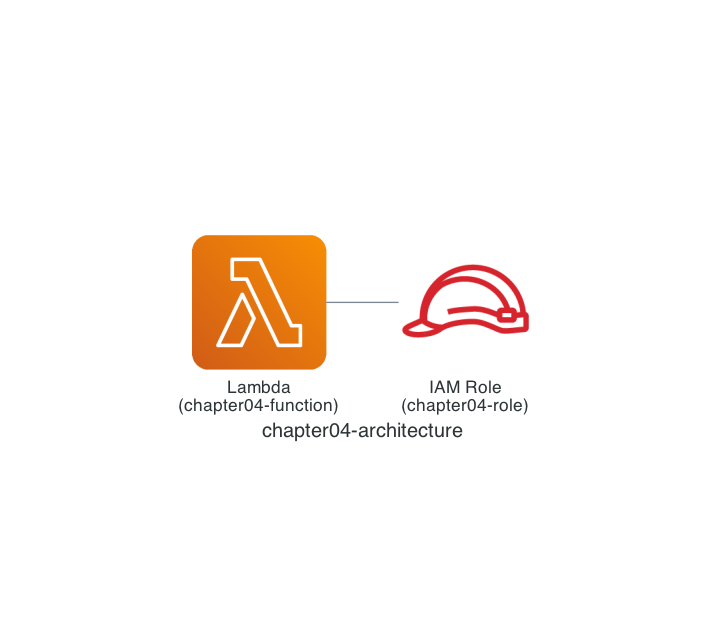

# Chapter 4: Deploy an AWS Lambda Function

In Chapter 4, let's use Terraform to deploy an AWS Lambda function.

## Architecture

The configuration we will deploy looks like the architecture below. It is a simple setup with an AWS Lambda function and an IAM role.



## Read `main.tf`

In Chapter 4, unlike the previous chapters, I will introduce the Terraform code first.

Let's start with the [aws_lambda_function](https://registry.terraform.io/providers/hashicorp/aws/latest/docs/resources/lambda_function) resource defined at the end of `main.tf`. As the name suggests, it is the resource that defines an AWS Lambda function. The `function_name` argument of `aws_lambda_function` is the function name, and `runtime` is the runtime — these should be easy to picture.

The IAM role set in the `role` argument is defined in a separate [aws_iam_role](https://registry.terraform.io/providers/hashicorp/aws/latest/docs/resources/iam_role) resource.

> [!NOTE]
> One benefit of LocalStack is that you can use it without IAM restrictions, but since the `role` argument of the `aws_lambda_function` resource is required, we configure the bare minimum 👌.

The `filename` and `source_code_hash` arguments are covered in the code walkthrough at the end of Chapter 4.

```hcl
data "aws_iam_policy_document" "assume_role" {
  statement {
    effect = "Allow"

    principals {
      type        = "Service"
      identifiers = ["lambda.amazonaws.com"]
    }

    actions = ["sts:AssumeRole"]
  }
}

resource "aws_iam_role" "lambda_execution_role" {
  name               = "chapter04-role"
  assume_role_policy = data.aws_iam_policy_document.assume_role.json
}

data "archive_file" "chapter04" {
  type        = "zip"
  source_dir  = "${path.module}/function/src"
  output_path = "${path.module}/function/dist/chapter04.zip"
}

resource "aws_lambda_function" "chapter04" {
  function_name    = "chapter04-function"
  handler          = "app.lambda_handler"
  runtime          = "python3.13"
  role             = aws_iam_role.lambda_execution_role.arn
  filename         = "${path.module}/function/dist/chapter04.zip"
  source_code_hash = data.archive_file.chapter04.output_base64sha256
}
```

## Deploy with Terraform (`terraform init`)

First, initialize with the `terraform init` command (the `tflocal init` command).

```sh
$ cd ${CODESPACE_VSCODE_FOLDER}/chapter04
$ tflocal init
```

## Deploy with Terraform (`terraform plan`)

Next, use the `terraform plan` command (the `tflocal plan` command) to preview the changes. Looking at the last line, `2 to add` means two resources will be added. And searching for the string `... will be created`, you can confirm that two resources will be added: the IAM role `aws_iam_role.lambda_execution_role` and the AWS Lambda function `aws_lambda_function.chapter04`.

```sh
$ tflocal plan
Terraform used the selected providers to generate the following execution plan. Resource actions are indicated with the following symbols:
  + create

Terraform will perform the following actions:

  # aws_iam_role.lambda_execution_role will be created
  + resource "aws_iam_role" "lambda_execution_role" {
      + arn                   = (known after apply)
      + assume_role_policy    = jsonencode(
            {
              + Statement = [
                  + {
                      + Action    = "sts:AssumeRole"
                      + Effect    = "Allow"
                      + Principal = {
                          + Service = "lambda.amazonaws.com"
                        }
                    },
                ]
              + Version   = "2012-10-17"
            }
        )
      + create_date           = (known after apply)
      + force_detach_policies = false
      + id                    = (known after apply)
      + managed_policy_arns   = (known after apply)
      + max_session_duration  = 3600
      + name                  = "chapter04-role"
      + name_prefix           = (known after apply)
      + path                  = "/"
      + tags_all              = (known after apply)
      + unique_id             = (known after apply)

      + inline_policy (known after apply)
    }

  # aws_lambda_function.chapter04 will be created
  + resource "aws_lambda_function" "chapter04" {
      + architectures                  = (known after apply)
      + arn                            = (known after apply)
      + code_sha256                    = (known after apply)
      + filename                       = "./function/dist/chapter04.zip"
      + function_name                  = "chapter04-function"
      + handler                        = "app.lambda_handler"
      + id                             = (known after apply)
      + invoke_arn                     = (known after apply)
      + last_modified                  = (known after apply)
      + memory_size                    = 128
      + package_type                   = "Zip"
      + publish                        = false
      + qualified_arn                  = (known after apply)
      + qualified_invoke_arn           = (known after apply)
      + reserved_concurrent_executions = -1
      + role                           = (known after apply)
      + runtime                        = "python3.13"
      + signing_job_arn                = (known after apply)
      + signing_profile_version_arn    = (known after apply)
      + skip_destroy                   = false
      + source_code_hash               = "oG5IjnWwks/rbuIDkaDRQF/2caONc4cAtIex9N0dB4Q="
      + source_code_size               = (known after apply)
      + tags_all                       = (known after apply)
      + timeout                        = 3
      + version                        = (known after apply)

      + ephemeral_storage (known after apply)

      + logging_config (known after apply)

      + tracing_config (known after apply)
    }

Plan: 2 to add, 0 to change, 0 to destroy.
```

## Deploy with Terraform (`terraform apply`)

Finally, deploy with the `terraform apply` command (the `tflocal apply` command).

> [!NOTE]
> You will be prompted with `Enter a value:`, so type `yes`.

```sh
$ tflocal apply

(omitted)

Do you want to perform these actions?
  Terraform will perform the actions described above.
  Only 'yes' will be accepted to approve.

  Enter a value: yes

aws_iam_role.lambda_execution_role: Creating...
aws_iam_role.lambda_execution_role: Creation complete after 0s [id=chapter04-role]
aws_lambda_function.chapter04: Creating...
aws_lambda_function.chapter04: Still creating... [10s elapsed]
aws_lambda_function.chapter04: Still creating... [20s elapsed]
aws_lambda_function.chapter04: Still creating... [30s elapsed]
aws_lambda_function.chapter04: Creation complete after 38s [id=chapter04-function]

Apply complete! Resources: 2 added, 0 changed, 0 destroyed.
```

If you see `Apply complete! Resources: 2 added, 0 changed, 0 destroyed.`, it worked!

## Verify the Resources

Let's use the LocalStack AWS CLI (the `awslocal` command) to check chapter04-function! The AWS Lambda function should be deployed.

```sh
$ awslocal lambda get-function --function-name chapter04-function \
    --query 'Configuration.[FunctionName, Runtime, State]'
[
    "chapter04-function",
    "python3.13",
    "Active"
]
```

That's it for Chapter 4! ✋

## Code Walkthrough

Here is a quick walkthrough of the key points in the code. Feel free to skip this section.

### `provider.tf`

Same as Chapter 2.

### `main.tf`

First, the [archive_file](https://registry.terraform.io/providers/hashicorp/archive/latest/docs/data-sources/file) data source packages the specified directory into a zip file. The zip file is generated when you run the `terraform plan` command (the `tflocal plan` command).

```hcl
data "archive_file" "chapter04" {
  type        = "zip"
  source_dir  = "${path.module}/function/src"
  output_path = "${path.module}/function/dist/chapter04.zip"
}
```

An AWS Lambda function works by packaging the code and its libraries into a zip file and uploading it. We specify the zip file generated by the `archive_file` data source in the `filename` argument of the `aws_lambda_function` resource. In addition, `source_code_hash` is set to the Base64-encoded SHA-256 hash of the zip file, which Terraform uses to decide whether to update the AWS Lambda function's code.

```hcl
resource "aws_lambda_function" "chapter04" {
  function_name    = "chapter04-function"
  handler          = "app.lambda_handler"
  runtime          = "python3.13"
  role             = aws_iam_role.lambda_execution_role.arn
  filename         = "${path.module}/function/dist/chapter04.zip"
  source_code_hash = data.archive_file.chapter04.output_base64sha256
}
```

### `function/src/app.py`

Since the goal of Chapter 4 is to deploy an AWS Lambda function, the actual code is a simple implementation that just prints one line to the log.

```python
def lambda_handler(event, context):
    print('aws-terraform-workshop-using-localstack')
```

That's it for the code walkthrough.

**Next: [Chapter 5: Deploy a Serverless Application](05-s3-lambda.md)**
