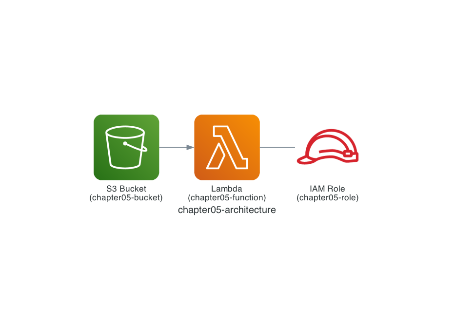

# Chapter 5: Deploy a Serverless Application

You are probably getting used to Terraform. In Chapter 5, let's combine the Amazon S3 bucket and the AWS Lambda function we deployed in Chapters 2, 3, and 4 to deploy a serverless application.

## Architecture

The configuration we will deploy looks like the architecture below. When you upload an object to the Amazon S3 bucket, the AWS Lambda function is triggered. We also deploy the event source mapping that triggers the AWS Lambda function.

It is simple, but it is already a proper serverless application!



## Read `main.tf`

In Chapter 5, too, I will introduce the Terraform code first. Much of the Terraform code is the same as in Chapter 4, but the big difference is the [aws_s3_bucket_notification](https://registry.terraform.io/providers/hashicorp/aws/latest/docs/resources/s3_bucket_notification) resource.

This configures "when and where to send notifications" for the Amazon S3 bucket. This time, when an object is uploaded to the Amazon S3 bucket `chapter05-bucket` (`s3:ObjectCreated:*`), it is set to invoke the AWS Lambda function.

```hcl
resource "aws_s3_bucket" "chapter05" {
  bucket = "chapter05-bucket"
}

resource "aws_s3_bucket_notification" "chapter05" {
  bucket = aws_s3_bucket.chapter05.id

  lambda_function {
    lambda_function_arn = aws_lambda_function.chapter05.arn
    events              = ["s3:ObjectCreated:*"]
  }
}
```

Another important resource is the [aws_lambda_permission](https://registry.terraform.io/providers/hashicorp/aws/latest/docs/resources/lambda_permission) resource. This configures "which resource can invoke which AWS Lambda function." To combine Amazon S3 and an AWS Lambda function — since each is an independent service — we need to grant the permission "the Amazon S3 bucket `chapter05-bucket` is allowed to invoke the AWS Lambda function `chapter05-function`."

```hcl
resource "aws_lambda_permission" "chapter05" {
  action        = "lambda:InvokeFunction"
  function_name = aws_lambda_function.chapter05.arn
  principal     = "s3.amazonaws.com"
  source_arn    = aws_s3_bucket.chapter05.arn
}
```

## Deploy with Terraform

Let's deploy following the same steps as before.

```sh
$ cd ${CODESPACE_VSCODE_FOLDER}/chapter05
$ tflocal init
$ tflocal plan
$ tflocal apply

(omitted)

Do you want to perform these actions?
  Terraform will perform the actions described above.
  Only 'yes' will be accepted to approve.

  Enter a value: yes

aws_iam_role.lambda_execution_role: Creating...
aws_s3_bucket.chapter05: Creating...
aws_iam_role.lambda_execution_role: Creation complete after 0s [id=chapter05-role]
aws_lambda_function.chapter05: Creating...
aws_s3_bucket.chapter05: Creation complete after 0s [id=chapter05-bucket]
aws_lambda_function.chapter05: Creation complete after 5s [id=chapter05-function]
aws_lambda_permission.chapter05: Creating...
aws_s3_bucket_notification.chapter05: Creating...
aws_lambda_permission.chapter05: Creation complete after 0s [id=terraform-20250224151943706500000001]
aws_s3_bucket_notification.chapter05: Creation complete after 0s [id=chapter05-bucket]

Apply complete! Resources: 5 added, 0 changed, 0 destroyed.
```

## Run the Serverless Application

The AWS Lambda function we deployed prints the bucket name and the object name (file name) to the log when an object is uploaded to the Amazon S3 bucket. Let's use the LocalStack AWS CLI (the `awslocal` command) to run the AWS Lambda function.

```sh
$ awslocal s3api put-object \
  --bucket chapter05-bucket \
  --key main.tf \
  --body ./main.tf
```

## Verify the Resources

Let's use the LocalStack AWS CLI (the `awslocal` command) to check the logs in the `/aws/lambda/chapter05-function` log group!

```sh
$ awslocal logs tail /aws/lambda/chapter05-function
```

You should see logs like the following.

```log
bucket = chapter05-bucket
key = main.tf
```

That's it for Chapter 5! ✋

## Code Walkthrough

Here is a quick walkthrough of the key points in the code. Feel free to skip this section.

### `provider.tf`

Same as Chapter 2.

### `main.tf`

Already explained above in Chapter 5.

### `function/src/app.py`

The AWS Lambda function's Python code is a simple implementation that just prints the bucket name and the object name (file name) to the log.

```python
def lambda_handler(event, context):
    print(f'bucket = {event['Records'][0]['s3']['bucket']['name']}')
    print(f'key = {event['Records'][0]['s3']['object']['key']}')
```

That's it for the code walkthrough.

**Next: [Chapter 6: Understand Resource Replacement](06-replace.md)**
