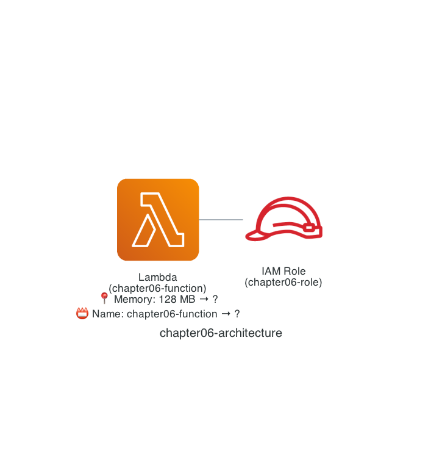

# Chapter 6: Understand Resource Replacement

In Chapter 3, we experienced modifying an Amazon S3 bucket deployed with Terraform. In Chapter 6, I will introduce "resource replacement," which you need to watch out for when modifying resources like this.

## Architecture

The configuration we will deploy looks like the architecture below. Like Chapter 4, it is a simple setup with an AWS Lambda function and an IAM role, and we change the AWS Lambda function's "memory size" and "function name."



## Deploy with Terraform

Let's deploy following the same steps as before.

```sh
$ cd ${CODESPACE_VSCODE_FOLDER}/chapter06
$ tflocal init
$ tflocal plan
$ tflocal apply
```

## 1. Change the Memory Size

First, let's change the "memory size." The Terraform code does not specify a memory size, so the default value is `128 MB`. Open `main.tf` and set the `memory_size` argument to `256`.

```diff hcl
 resource "aws_lambda_function" "chapter06" {
   function_name    = "chapter06-function"
   handler          = "app.lambda_handler"
   runtime          = "python3.13"
   role             = aws_iam_role.lambda_execution_role.arn
+  memory_size      = 256
   filename         = "${path.module}/function/dist/chapter06.zip"
   source_code_hash = data.archive_file.chapter06.output_base64sha256
 }
```

### Deploy with Terraform

Let's deploy following the same steps as before. As you can see from the `128 -> 256` and `1 to change` results of the `terraform plan` command (the `tflocal plan` command), the AWS Lambda function's memory size is being changed.

```sh
$ tflocal plan
Terraform used the selected providers to generate the following execution plan. Resource actions are indicated with the following symbols:
  ~ update in-place

Terraform will perform the following actions:

  # aws_lambda_function.chapter06 will be updated in-place
  ~ resource "aws_lambda_function" "chapter06" {
        id                             = "chapter06-function"
      ~ memory_size                    = 128 -> 256
        tags                           = {}
        # (28 unchanged attributes hidden)

        # (3 unchanged blocks hidden)
    }

Plan: 0 to add, 1 to change, 0 to destroy.

$ tflocal apply

(omitted)

Do you want to perform these actions?
  Terraform will perform the actions described above.
  Only 'yes' will be accepted to approve.

  Enter a value: yes

aws_lambda_function.chapter06: Modifying... [id=chapter06-function]
aws_lambda_function.chapter06: Modifications complete after 5s [id=chapter06-function]

Apply complete! Resources: 0 added, 1 changed, 0 destroyed.
```

## 2. Change the AWS Lambda Function Name

Now let's change the "AWS Lambda function name." Open `main.tf` again and change the value of the `function_name` argument.

```diff hcl
 resource "aws_lambda_function" "chapter06" {
-  function_name    = "chapter06-function"
+  function_name    = "chapter06-function-update"
   handler          = "app.lambda_handler"
   runtime          = "python3.13"
   role             = aws_iam_role.lambda_execution_role.arn
   memory_size      = 256
   filename         = "${path.module}/function/dist/chapter06.zip"
   source_code_hash = data.archive_file.chapter06.output_base64sha256
 }
```

### Deploy with Terraform (`terraform plan`)

When you run the `terraform plan` command (the `tflocal plan` command) here, the second line shows `-/+ destroy and then create replacement`. And at the end, it shows `1 to add, 0 to change, 1 to destroy.`. Why? We only changed the AWS Lambda function name... 😇

The important point is that this is not a resource modification but a resource replacement (destroy and re-create). Terraform code defines "the desired state = the expected state," so the deployed result matches what you expect. But when you try to change a setting that cannot be changed, such as an AWS Lambda function name, the behavior is to delete that resource once and create a new one.

```sh
$ tflocal plan
Terraform used the selected providers to generate the following execution plan. Resource actions are indicated with the following symbols:
-/+ destroy and then create replacement

Terraform will perform the following actions:

  # aws_lambda_function.chapter06 must be replaced
-/+ resource "aws_lambda_function" "chapter06" {
      ~ architectures                  = [
          - "x86_64",
        ] -> (known after apply)
      ~ arn                            = "arn:aws:lambda:us-east-1:000000000000:function:chapter06-function" -> (known after apply)
      ~ code_sha256                    = "db6IBGnhuoZAr9WyGpUfpjGWnfqgitLi/YjE8hrRfGo=" -> (known after apply)
      ~ function_name                  = "chapter06-function" -> "chapter06-function-update" # forces replacement
      ~ id                             = "chapter06-function" -> (known after apply)
      ~ invoke_arn                     = "arn:aws:apigateway:us-east-1:lambda:path/2015-03-31/functions/arn:aws:lambda:us-east-1:000000000000:function:chapter06-function/invocations" -> (known after apply)
      ~ last_modified                  = "2025-02-24T15:29:17.754774+0000" -> (known after apply)
      - layers                         = [] -> null
      ~ qualified_arn                  = "arn:aws:lambda:us-east-1:000000000000:function:chapter06-function:$LATEST" -> (known after apply)
      ~ qualified_invoke_arn           = "arn:aws:apigateway:us-east-1:lambda:path/2015-03-31/functions/arn:aws:lambda:us-east-1:000000000000:function:chapter06-function:$LATEST/invocations" -> (known after apply)
      + signing_job_arn                = (known after apply)
      + signing_profile_version_arn    = (known after apply)
      ~ source_code_size               = 187 -> (known after apply)
      - tags                           = {} -> null
      ~ tags_all                       = {} -> (known after apply)
      ~ version                        = "$LATEST" -> (known after apply)
        # (15 unchanged attributes hidden)

      ~ ephemeral_storage (known after apply)
      - ephemeral_storage {
          - size = 512 -> null
        }

      ~ logging_config (known after apply)
      - logging_config {
          - log_format            = "Text" -> null
          - log_group             = "/aws/lambda/chapter06-function" -> null
            # (2 unchanged attributes hidden)
        }

      ~ tracing_config (known after apply)
      - tracing_config {
          - mode = "PassThrough" -> null
        }
    }

Plan: 1 to add, 0 to change, 1 to destroy.
```

Resource replacement is not necessarily a problem, but replacing a resource that is running in a production environment could cause operational problems for your architecture. Before deploying, it is important to check whether an unintended resource replacement is about to happen.

That's it for Chapter 6! ✋

## Code Walkthrough

Here is a quick walkthrough of the key points in the code. Feel free to skip this section.

### `provider.tf`

Same as Chapter 2.

### `main.tf`

Same as Chapter 4 (only the chapter number differs).

That's it for the code walkthrough.

**Next: [Chapter 7: Import Existing Resources](07-import.md)**
