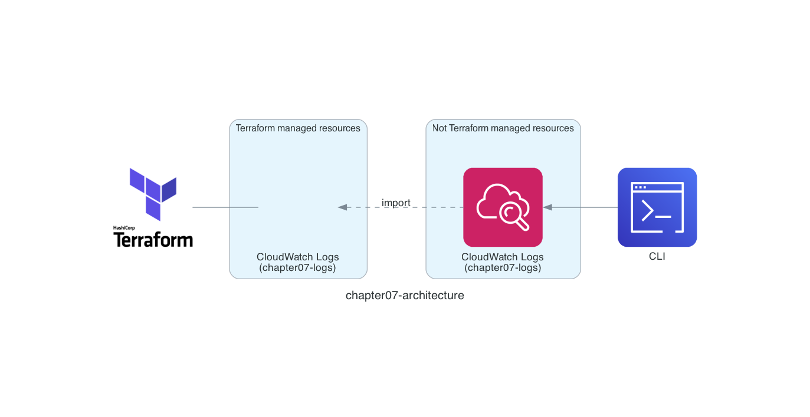

# Chapter 7: Import Existing Resources

In Chapter 7, we experience importing existing resources, which you might use when adopting Terraform partway through a project.

Terraform has two ways to import existing resources: the [terraform import command](https://developer.hashicorp.com/terraform/cli/commands/import) and the `import` block. In Chapter 7, I introduce the `import` block, which became available in Terraform 1.5 and later.

See the [Import documentation](https://developer.hashicorp.com/terraform/language/import) for details.

## Architecture

The configuration we will deploy looks like the architecture below. We import an Amazon CloudWatch Logs log group deployed with the AWS CLI so that it can be managed with Terraform.



## Oops, I Configured It in the Management Console

It would be nice if you could deploy AWS resources with Terraform from the very beginning, but the reality in the field is often different. For example, maybe you configured something in the Management Console at first but later decided to adopt Terraform, or you needed to use a new resource that the Terraform AWS Provider did not yet support and configured it with the AWS CLI for speed, and then the Terraform AWS Provider added support for it later.

## Deploy with the AWS CLI

First, let's create an Amazon CloudWatch log group with the AWS CLI. Run the `awslocal logs describe-log-groups` command to confirm the Amazon CloudWatch log group `chapter07-logs`.

```sh
$ awslocal logs create-log-group --log-group-name chapter07-logs
$ awslocal logs describe-log-groups --log-group-name-prefix chapter07
{
    "logGroups": [
        {
            "logGroupName": "chapter07-logs",
            "creationTime": 1740411041706,
            "metricFilterCount": 0,
            "arn": "arn:aws:logs:us-east-1:000000000000:log-group:chapter07-logs:*",
            "storedBytes": 0
        }
    ]
}
```

## Import with Terraform

Now, let's import the Amazon CloudWatch log group. The scenario is: "I need to change the settings of the Amazon CloudWatch log group I deployed with the AWS CLI, but I am also adopting Terraform in parallel, so it would be great to change the settings from Terraform instead of the AWS CLI... 😅"

Here is `main.tf`. When importing an existing resource into Terraform, you first implement the Terraform code that represents "the desired state = the expected state." This time, we use the [aws_cloudwatch_log_group](https://registry.terraform.io/providers/hashicorp/aws/latest/docs/resources/cloudwatch_log_group) resource to import the Amazon CloudWatch log group.

```hcl
resource "aws_cloudwatch_log_group" "chapter07" {
  name = "chapter07-logs"
}
```

The important part is the `import` block. Set the Terraform resource to associate in `to`, and set "the value that identifies the existing resource" in `id`. So in this example, the Amazon CloudWatch log group `chapter07-logs` deployed with the AWS CLI is associated with the Terraform resource `aws_cloudwatch_log_group.chapter07`.

> [!NOTE]
> "The value that identifies the existing resource" differs by resource. It is documented in the Import section of the documentation, such as for [aws_cloudwatch_log_group](https://registry.terraform.io/providers/hashicorp/aws/latest/docs/resources/cloudwatch_log_group).

```hcl
import {
  to = aws_cloudwatch_log_group.chapter07
  id = "chapter07-logs"
}
```

The rest of the steps are the same as before. Run the `terraform plan` command (the `tflocal plan` command) to check the import result, and run the `terraform apply` command (the `tflocal apply` command) to import.

```sh
$ cd ${CODESPACE_VSCODE_FOLDER}/chapter07
$ tflocal init
$ tflocal plan
Terraform will perform the following actions:

  # aws_cloudwatch_log_group.chapter07 will be imported
    resource "aws_cloudwatch_log_group" "chapter07" {
        arn               = "arn:aws:logs:us-east-1:000000000000:log-group:chapter07-logs"
        id                = "chapter07-logs"
        kms_key_id        = null
        log_group_class   = null
        name              = "chapter07-logs"
        name_prefix       = null
        retention_in_days = 0
        skip_destroy      = false
        tags              = {}
        tags_all          = {}
    }

Plan: 1 to import, 0 to add, 0 to change, 0 to destroy.

$ tflocal apply

(omitted)

aws_cloudwatch_log_group.chapter07: Importing... [id=chapter07-logs]
aws_cloudwatch_log_group.chapter07: Import complete [id=chapter07-logs]

Apply complete! Resources: 1 imported, 0 added, 0 changed, 0 destroyed.
```

If you see `Apply complete! Resources: 1 imported, 0 added, 0 changed, 0 destroyed.`, it worked!

## Change the Retention Period

Once you have associated the resource as a Terraform resource with the `import` block, you can change it just like before. The retention period of an Amazon CloudWatch log group is unlimited by default, so let's reduce it to 7 days.

```diff hcl
 resource "aws_cloudwatch_log_group" "chapter07" {
   name = "chapter07-logs"
+  retention_in_days = 7
 }
```

Here is a side note. Terraform code has a somewhat fixed format, one rule of which is to align the vertical position of the `=` signs in arguments. In the example above, adding `retention_in_days` misaligns the `=` positions of `name` and `retention_in_days`. Let's run the `terraform fmt` command.

```sh
$ terraform fmt
```

It should be formatted automatically. In this way, you can keep a consistent format during team development.

```hcl
resource "aws_cloudwatch_log_group" "chapter07" {
  name              = "chapter07-logs"
  retention_in_days = 7
}
```

Back to the main topic. Run the `terraform plan` command (the `tflocal plan` command) and the `terraform apply` command (the `tflocal apply` command) to deploy the retention period change.

```sh
$ tflocal plan
Terraform used the selected providers to generate the following execution plan. Resource actions are indicated with the following symbols:
  ~ update in-place

Terraform will perform the following actions:

  # aws_cloudwatch_log_group.chapter07 will be updated in-place
  ~ resource "aws_cloudwatch_log_group" "chapter07" {
        id                = "chapter07-logs"
        name              = "chapter07-logs"
      ~ retention_in_days = 0 -> 7
        tags              = {}
        # (6 unchanged attributes hidden)
    }

Plan: 0 to add, 1 to change, 0 to destroy.

$ tflocal apply

(omitted)

aws_cloudwatch_log_group.chapter07: Modifying... [id=chapter07-logs]
aws_cloudwatch_log_group.chapter07: Modifications complete after 0s [id=chapter07-logs]

Apply complete! Resources: 0 added, 1 changed, 0 destroyed.
```

If you see `Apply complete! Resources: 0 added, 1 changed, 0 destroyed.`, it worked!

## Verify the Resources

Run the `awslocal logs describe-log-groups` command, and if you see `"retentionInDays": 7`, it worked!

Congratulations 🎉 You imported the Amazon CloudWatch Logs log group deployed with the AWS CLI into Terraform.

```sh
$ awslocal logs describe-log-groups --log-group-name-prefix chapter07
{
    "logGroups": [
        {
            "logGroupName": "chapter07-logs",
            "creationTime": 1740411041706,
            "retentionInDays": 7,
            "metricFilterCount": 0,
            "arn": "arn:aws:logs:us-east-1:000000000000:log-group:chapter07-logs:*",
            "storedBytes": 0
        }
    ]
}
```

## Should You Import?

In Chapter 7, we experienced importing with Terraform. It is convenient when you want to bring existing resources under Terraform management, but it is important to think about whether you really should import. Instead of importing, you can also consider whether you could re-create the resource you are about to import and swap it out.

For example, for the Amazon CloudWatch Logs log group we imported in Chapter 7, you might be able to deploy a new resource and switch the output destination in the application settings. Of course, you would need to keep the existing logs until their retention period ends, but you would gain the benefit of deploying the resource with Terraform from the start.

What about an Amazon S3 bucket, another resource you might import in Chapter 7? If you are serving static assets combined with Amazon CloudFront, swapping it out takes some effort (though it should still be possible 😀), but if the bucket is used to archive backups you have taken, you might be able to deploy a new resource and switch the backup feature's settings. Here too, you would need to keep the backups until their retention period ends.

Other resources such as IAM roles and security groups are also relatively easy to swap out. So the next time the idea "let's import!" comes to mind, take a moment to consider whether you should import.

That's it for Chapter 7! ✋

## Code Walkthrough

Here is a quick walkthrough of the key points in the code. Feel free to skip this section.

### `provider.tf`

Same as Chapter 2.

### `main.tf`

This time we implemented the `import` block in `main.tf`, but you can also consolidate it into an `imports.tf` file. It is worth discussing with your team.

> You can add an import block to any Terraform configuration file. A common pattern is to create an imports.tf file, or to place each import block beside the resource block it imports into.

See the [Import documentation](https://developer.hashicorp.com/terraform/language/import) for details.

Also, whether to keep the `import` block after importing an existing resource into Terraform is worth discussing with your team. Personally, I often choose to keep it, because it records the historical context that "this was originally an existing resource." What about you?

> After importing, you can optionally remove import blocks from your configuration or leave them as a record of the resource's origin.

See the [Import documentation](https://developer.hashicorp.com/terraform/language/import) for details.

```hcl
import {
  to = aws_cloudwatch_log_group.chapter07
  id = "chapter07-logs"
}
```

That's it for the code walkthrough.

**Next: [Chapter 8: Run Static Analysis](08-linter.md)**
