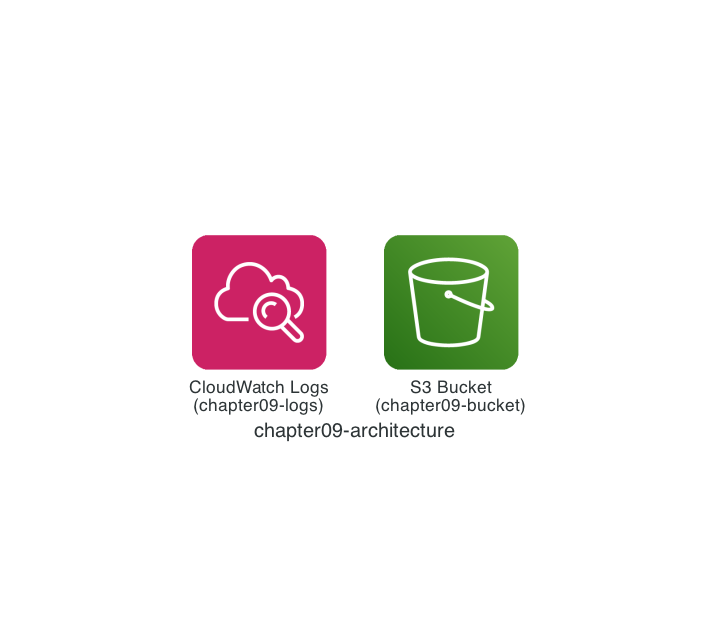

# Chapter 9: Learn the Basics of State Files

Actually, up to this point I have not explained how Terraform manages the state of AWS resources. That is because I believe experiencing how to deploy AWS resources with Terraform is more important than anything else.

In Chapter 9, I introduce the basics of the state file (`terraform.tfstate`) that Terraform uses to manage the state of resources.

## Architecture

The configuration we will deploy looks like the architecture below. We deploy an Amazon S3 bucket and an Amazon CloudWatch Logs log group.



## Deploy with Terraform

Let's deploy following the same steps as before.

```sh
$ cd ${CODESPACE_VSCODE_FOLDER}/chapter09
$ tflocal init
$ tflocal plan
$ tflocal apply

(omitted)

Do you want to perform these actions?
  Terraform will perform the actions described above.
  Only 'yes' will be accepted to approve.

  Enter a value: yes

aws_cloudwatch_log_group.chapter09: Creating...
aws_s3_bucket.chapter09: Creating...
aws_cloudwatch_log_group.chapter09: Creation complete after 0s [id=chapter09-logs]
aws_s3_bucket.chapter09: Creation complete after 0s [id=chapter09-bucket]

Apply complete! Resources: 2 added, 0 changed, 0 destroyed.
```

If you see `Apply complete! Resources: 2 added, 0 changed, 0 destroyed.`, it worked!

## State File

Now, a file called `terraform.tfstate` should have been created in the `chapter09` directory. In fact, a file with the same name was created in Chapters 2 through 8 as well.

Let's open the `terraform.tfstate` file. It is a complex JSON file, so you do not need to understand all of it. Just skim through it. In particular, if you look inside `resources`, you should find the deployed `aws_cloudwatch_log_group` `chapter09` and the `aws_s3_bucket` `chapter09`!

The important point is that Terraform uses this state file to manage "the state of the deployed resources."

See the [State documentation](https://developer.hashicorp.com/terraform/language/state) for details.

## `terraform state` Command

The Terraform CLI (the `terraform` command) also has commands to manage the state file. Let's get a list of resources with the `terraform state list` command. As expected, you can confirm two resources.

```sh
$ terraform state list
aws_cloudwatch_log_group.chapter09
aws_s3_bucket.chapter09
```

For details, see the [`terraform state list` command documentation](https://developer.hashicorp.com/terraform/cli/commands/state/list).

The `terraform state show` command lets you check the details of a specified resource.

```sh
$ terraform state show aws_cloudwatch_log_group.chapter09
# aws_cloudwatch_log_group.chapter09:
resource "aws_cloudwatch_log_group" "chapter09" {
    arn               = "arn:aws:logs:us-east-1:000000000000:log-group:chapter09-logs"
    id                = "chapter09-logs"
    kms_key_id        = null
    log_group_class   = null
    name              = "chapter09-logs"
    name_prefix       = null
    retention_in_days = 7
    skip_destroy      = false
    tags_all          = {}
}
```

For details, see the [`terraform state show` command documentation](https://developer.hashicorp.com/terraform/cli/commands/state/show).

## Managing the State File

Earlier, I explained that Terraform uses the state file to manage "the state of the deployed resources." In other words, without the state file, the information about "which resources were deployed" is lost, so Terraform tries to create new resources. Therefore, it is important to manage the state file properly.

There are many options, but for example, there is a mechanism to manage the state file in an Amazon S3 bucket.

See the [Terraform S3 Backend documentation](https://developer.hashicorp.com/terraform/language/backend/s3) for details.

As another option, using HCP Terraform (formerly Terraform Cloud) lets you handle everything from running Terraform to managing the state file on HCP Terraform.

See the [HCP Terraform state documentation](https://developer.hashicorp.com/terraform/cloud-docs/workspaces/state) for details.

## Terraform S3 Backend

In Chapter 9, let's try the **Terraform S3 Backend**, which manages the state file in an Amazon S3 bucket.

### `backend.tf`

Create a new file `chapter09/backend.tf` and configure the Terraform S3 Backend. This time, the setting is to manage a state file named `terraform.tfstate` in the Amazon S3 bucket `aws-terraform-workshop-using-localstack-tfstates`.

```hcl
terraform {
  backend "s3" {
    region = "us-east-1"
    bucket = "aws-terraform-workshop-using-localstack-tfstates"
    key    = "terraform.tfstate"
  }
}
```

The LocalStack Terraform CLI (the `tflocal` command) that we have used throughout this workshop also supports running this **Terraform S3 Backend** on LocalStack, automatically deploying the Amazon S3 bucket on LocalStack. So when you run the `terraform init` command (the `tflocal init` command) here, the state file is uploaded to the Amazon S3 bucket `aws-terraform-workshop-using-localstack-tfstates` on LocalStack.

```sh
$ tflocal init
Initializing the backend...
Acquiring state lock. This may take a few moments...
Do you want to copy existing state to the new backend?
  Pre-existing state was found while migrating the previous "local" backend to the
  newly configured "s3" backend. No existing state was found in the newly
  configured "s3" backend. Do you want to copy this state to the new "s3"
  backend? Enter "yes" to copy and "no" to start with an empty state.

  Enter a value: yes

Successfully configured the backend "s3"! Terraform will automatically
use this backend unless the backend configuration changes.
```

## Verify the Resources

Let's use the LocalStack AWS CLI (the `awslocal` command) to check the aws-terraform-workshop-using-localstack-tfstates bucket! The `terraform.tfstate` file should have been uploaded automatically.

```sh
$ awslocal s3api list-objects \
    --bucket aws-terraform-workshop-using-localstack-tfstates \
    --query 'Contents[].Key'
[
    "terraform.tfstate"
]
```

That's it for Chapter 9! ✋

## Code Walkthrough

Here is a quick walkthrough of the key points in the code. Feel free to skip this section.

### `provider.tf`

Same as Chapter 2.

### `main.tf`

Same as Chapter 2 and Chapter 7 — no additional explanation is needed anymore!

```hcl
resource "aws_s3_bucket" "chapter09" {
  bucket = "chapter09-bucket"
}

resource "aws_cloudwatch_log_group" "chapter09" {
  name              = "chapter09-logs"
  retention_in_days = 7
}
```

That's it for the code walkthrough.

---

**Back to the [Table of Contents](../README.md)**
